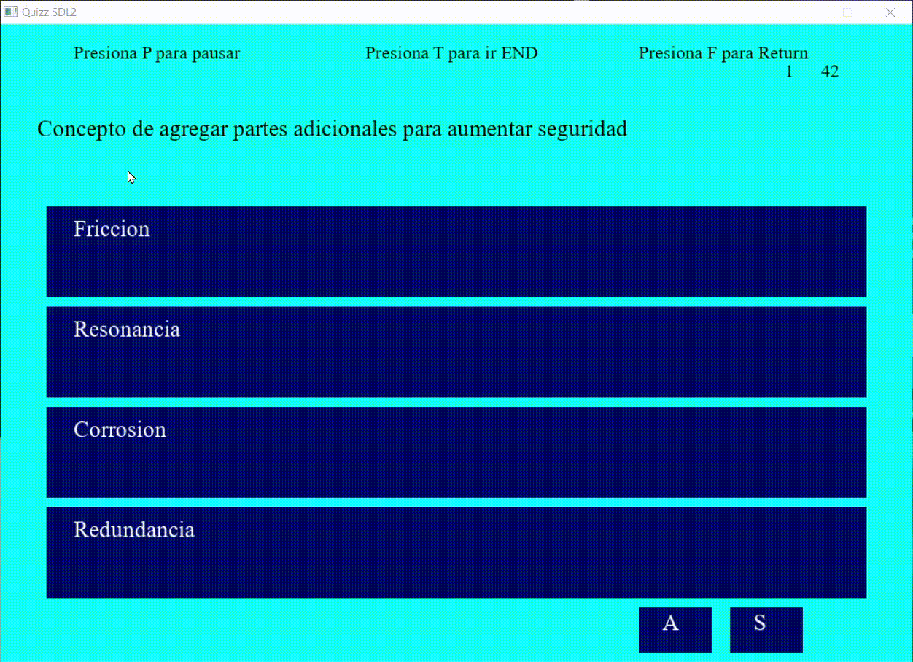
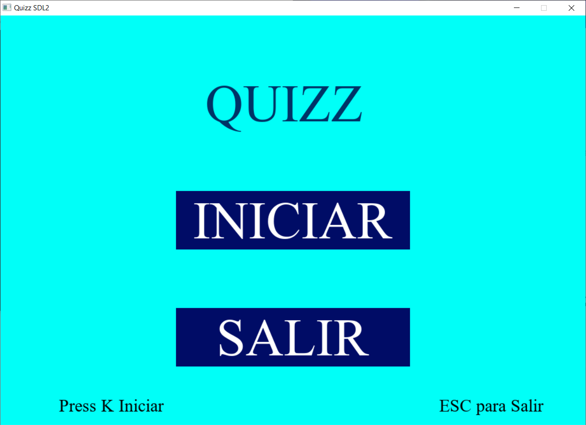
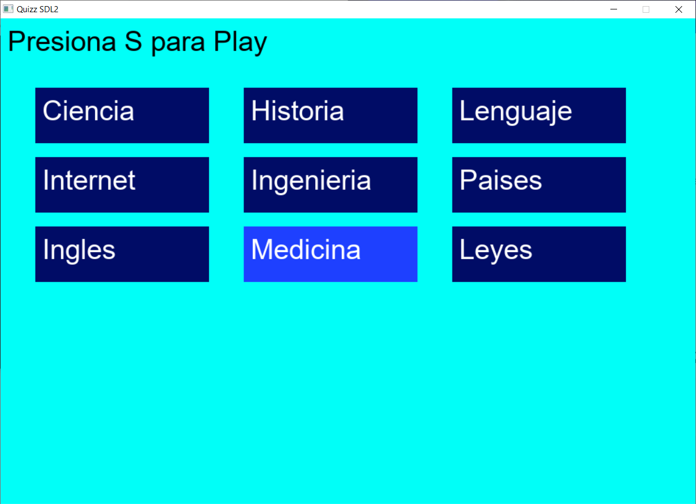
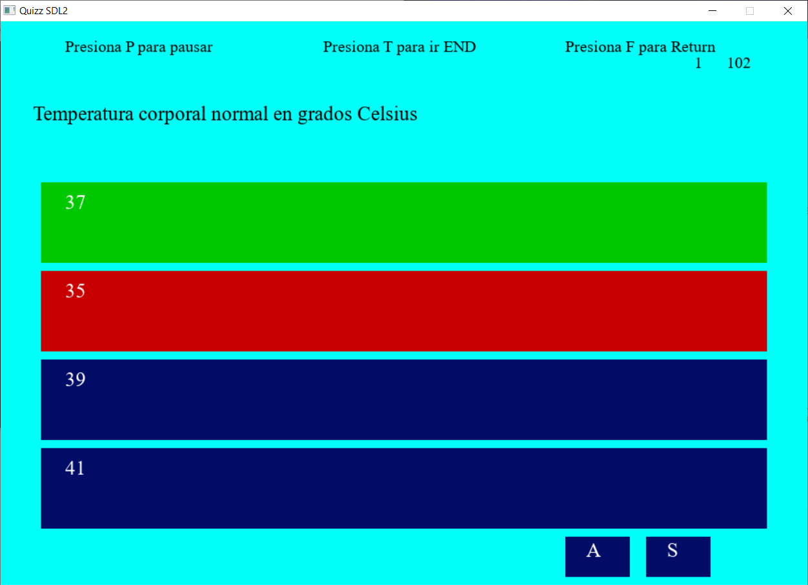
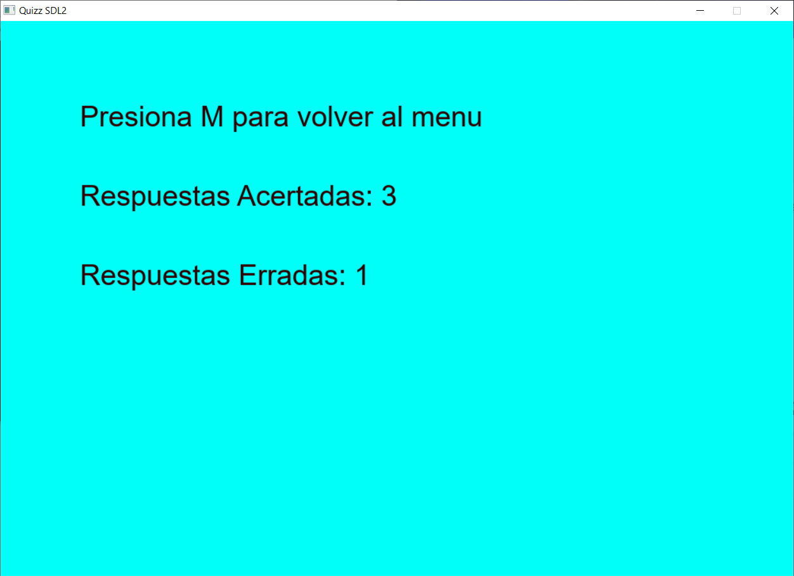

# Quiz Multi-Temático (C++/SDL2/SQLite) [](https://opensource.org/licenses/GPL-3.0)

Quiz interactivo multi-temático con **4 estados de flujo** (MENÚ, SELECCIÓN DE TEMA, QUIZ, RESULTADOS).

  
*(Ejemplo de interacción: respuestas correctas/incorrectas)* 

## 📌 Descripción
Quiz interactivo multi-temático con **4 estados de flujo** (MENÚ, SELECCIÓN DE TEMA, QUIZ, RESULTADOS), desarrollado en C++ con:
- **SDL2** para renderizado gráfico y manejo de inputs.
- **SQLite3** como base de datos para preguntas/respuestas.
- Arquitectura POO y CMake para compilacion.

## Características
### Core
- 4 Estados interactivos:  
  ```mermaid
  graph LR
    A[MENÚ] --> B[ELEGIR TEMA]
    B --> C[PLAY QUIZ]
    C --> D[SHOW RESULTS]
    D --> A 
    ```

- Puntuacion basada en acierto/errores mostrado al finalizar o forzar la finalizacion.
- Navegacion en preguntas con botones (Siguiente/Anterior).
- Feedback visual
    - Respuesta correcta -> Verde
    - Respuesta incorrectas -> Rojo

## Base de Datos
- Temas y preguntas cargadas desde `dbquizz.db` (SQLite).
- Consultas rápidas gracias a [SQLiteCpp](https://github.com/SRombauts/SQLiteCpp).

## Dependencias
| Biblioteca   | Uso                          |
|--------------|------------------------------|
| `SDL2`       | Renderizado/Inputs           |
| `SDL2_ttf`   | Renderizado de texto         |
| `SQLite3`    | Base de datos local          |

*Próximas integraciones: `SDL2_mixer` (sonido), `SDL2_image` (gráficos).*

## Instalación (Windows/MSYS2)
1. Instala dependencias en MSYS2 (UCRT64):
```bash
pacman -S mingw-w64-ucrt-x86_64-SDL2 mingw-w64-ucrt-x86_64-SDL2_ttf
```
2. Clona y compila con CMake:
```bash
git clone https://github.com/FranzChoqueQ/Quizz.git
cd quiz-sdl2/build
cmake -G "MinGW Makefiles" ..
mingw32-make
```

luego ejecuta el programa.

## Interaccion
- Raton: Seleccion de botones (respuestas, temas y navegación).
- Teclado: Teclas descritas para navegar por los estado o salir.

## 📸 Capturas de Pantalla

| Menú Principal | Selección de Tema | Pregunta | Resultados |
|----------------|-------------------|----------|------------|
|  |  |  |  |

## Arquitectura
```plaintext
QuizzSDL/
│
├── engine/               # Motor
│   ├── core/             # Componentes centrales
│   │   ├── Game.hpp      
│   │   ├── Game.cpp
│   │   ├── Window.hpp
│   │   ├── Window.cpp
│   │   ├── EventHandler.hpp
│   │   └── EventHandler.cpp
│   │
│   ├── ecs/              
│   ├── graphics/         # Subsistema gráfico
│   │   ├── TextureRender.hpp
│   │   └── TextureRender.cpp
│   │
│   └── audio/            # Subsistema de audio
│
├── game/                 # Código específico del juego
│   ├── Database/         # Base de Datos
│   └── States/           # Estados del juego
├── assets/
│   ├── textures/
│   ├── fonts/
│   └── sounds/
│
├── third_party/          # Dependencias externas
│   ├── SDL2/
│   ├── SDL2_image/
│   ├── SDL2_ttf/
│   └── SDL2_mixer/
│
├── build/                # Archivos de construcción
│   ├── debug/
│   └── release/
│
├── docs/                 # Documentación del proyecto
│
├── src/
|    └── main.cpp
├── CMakeLists.txt        # Sistema de construcción
├── .gitignore
└── README.md
```

## Licencia
[GPLv3](https://www.gnu.org/licenses/gpl-3.0):  
**Cualquier derivado de este proyecto debe ser código abierto.**

## Roadmap
- Mejorar cálculo de puntuación (evitar duplicados al navegar)
- Modo multijugador online
- Efectos de sonido con `SDL2_mixer`
- Integrar imágenes con `SDL2_image`

## NOTAS ADICIONALES
Las fuentes TTF deben ubicarse en: assets/ fonts
